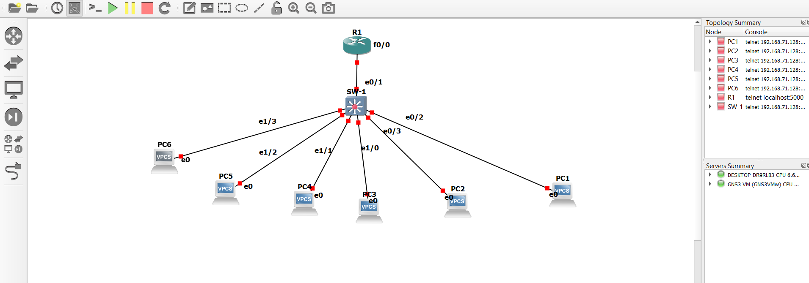

# 🌐 Enterprise Inter-VLAN Routing & Network Segmentation (GNS3)
## 📌 Project Overview
This project demonstrates a multi-department enterprise local area network (LAN) designed using Cisco devices in GNS3. The network isolates broadcast domains per department using VLANs and enables secure inter-VLAN routing using a Cisco Router (Router-on-a-Stick topology).
---
## 📐 Network Topology

---
## 📊 VLAN & Addressing Scheme

| Department | VLAN ID | Subnet Range | Switch Ports | Gateway IP |
| :--- | :--- | :--- | :--- | :--- |
| **Sales** | VLAN 10 | `192.168.10.0/24` | `Et0/2`, `Et0/3` | `192.168.10.1` |
| **IT Dept** | VLAN 20 | `192.168.20.0/24` | `Et1/0`, `Et1/1` | `192.168.20.1` |
| **HR Dept** | VLAN 30 | `192.168.30.0/24` | `Et1/2`, `Et1/3` | `192.168.30.1` |
| **Management** | VLAN 99 | `192.168.99.0/24` | N/A | `192.168.99.1` |

---
## 🛠️ Key Technologies Used
* **VLANs & Trunking (802.1Q)**: Departmental isolation and Trunk encapsulation on Interface `Et0/1`.
* **Inter-VLAN Routing**: Configured sub-interfaces on Cisco Router R1.
* **Duplex Configuration**: Fixed duplex mismatch settings on Ethernet links.
* **DHCP Service**: Centralized IP addressing from R1 to end-user devices.
---
## 📥 Download GNS3 Project File
You can download the full `.gns3project` lab file directly from [Google Drive](https://drive.google.com/file/d/1fLBHG75uARpd09abECoWGmSERJh57n-O/view?usp=sharing).
---
## 📁 Repository Contents
* `GNS3_Project_Documentation.pdf`: Complete official PDF report.
* `topology.png.png`: High-resolution network architecture diagram.
* `Screenshots`: Terminal execution logs and verification proofs.
